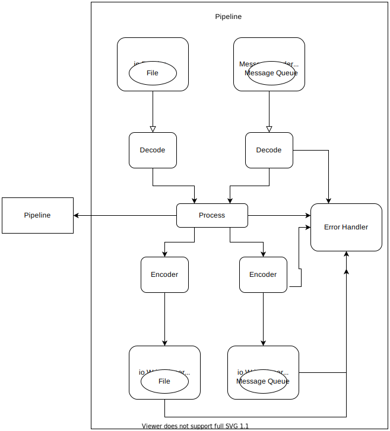

# Pipeline

## Architecture

Pipelines follow a general work flow:

By breaking up the pipeline into logical units we can achieve high amounts of flexibility and simultaneously
reduce the amount of code we need to write and test. Defining interfaces at the logical boundaries of
the pipeline allows you to fully customize any aspect of the pipeline without having to repeat code.

The pipeline reads, processes and writes concurrently for each reader that is registered.

### Input/Output (IO): 

The input and outputs of the pipe are byte streams. The pipeline accepts `MessageReader` and `io.Reader` interfaces
for the input and `io.WriteCloser` for the output. This gives users the flexibility to read and write from many sources
such as queues, TCP / UDP connections, files, S3, HTTP or gRPC.

The specific implementations just need to satisfy `MessageReader` / `io.Reader` for reads and  `io.WriteCloser` interfaces.
Adapters can be made around external clients in order to support these interfaces.

#### Input

Pipes can have two kinds of input, `MessageReader` which should perform a blocking read and return `[]byte` messages.
The second is `io.Reader`, which should read messages into the specified `[]byte`. 

#### Output

Pipes write to `io.WriteCloser`, which accept `[]byte`.

Some examples of input and output implementations are:
- Kestrel Queue
- S3
- Kafka
- REST over TCP
- gPPC over TCP

### Encoding and Decoding 

Encoding and decoding are done via interfaces so that the application can decide which encoding works best 
for it. In most cases this will be JSON as it is a comfortable and well-known format. However, some high 
performance applications may decide to use a more efficient encoding such as Protocol Buffers, or even
a different implementation of Go's JSON such as [easyjson](https://github.com/mailru/easyjson).

Each input is tied to it's own encoder, giving you the ability to have sources with differing encoding.

#### Decoding

Decoding is the process of converting the raw byte stream into a more developer friendly form
from which the pipeline can access during processing. It can have any implementation so long as it follows
the `Decoder` interface.

#### Encoding

Encoding is the process of converting output of the pipeline into a raw byte stream which can be accepted by
`PipeWriter`s. It can have any implementation so long as it follows the `Encoder` interface.

Some examples of `Encoder` / `Decoder` implementations are:
- JSON
- Google Protocol Buffers
- Gob
- XML
- HTML
 
### Processing

A pipeline is useless without the processing. You can inject your processing into the pipeline by implementing the
`Processor` interface. This interface is simple and accepts an open `interface{}`. This is because Go does not support
generics (yet). Regardless, this interface is safe(ish) because your decoder should decode the payload into the data
structure you have defined. In your processor, one of the first things you should do is do a type assertion / cast of
the `interface{}` into the data structure you are expecting. From then on out you are type safe!

In your `Run()` method you should do all the processing you want on the data and then return it. 
You should avoid writing to external sinks in the `Run()` method, this is what the `io.WriteCloser` is for.
 

### Error Handling

Errors can be handled by providing an error handling function to the pipeline with `Pipeline.SetErrorHandler()` 
Errors returned to the pipeline can provide certain qualitative information on the error so that error handlers
can more easily decide what to do. 

Currently, the pipeline looks for the following qualities in errors:

`Temporary` - Errors are temporary in nature like a network outage or 5XX series HTTP error.
`Fatal` - Errors that are fatal to the overall goal of the pipeline. 

The pipeline only receives a single error from the processing component of the pipeline.
This means applications must use the [errors](./errors.go) defined in this package to return 
errors in order to fully utilize the retry mechanism. When writing to `PipeWriter`s, the pipeline aggregates
and combines the errors returned from all writers.

#### Retrying (TODO)

Pipelines can set retry policies for errors by settings the `Retrier` interface.
The default retry policy is to retry on `Temporary` errors and to not retry on `Fatal` errors. 
 